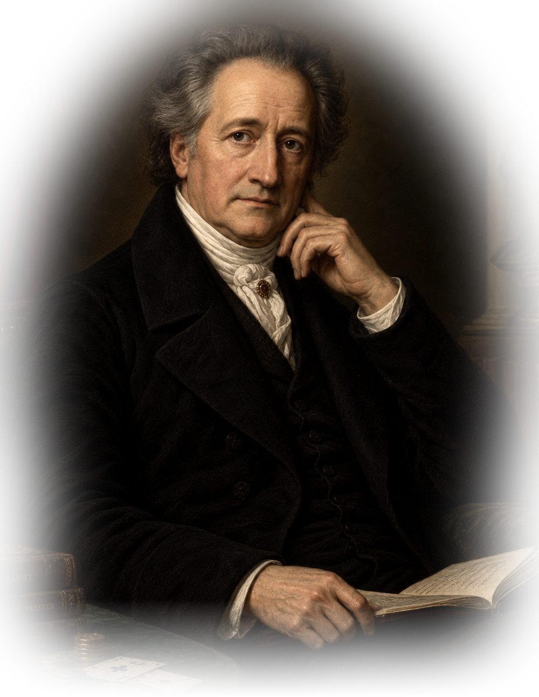

[index.html](https://github.com/user-attachments/files/32310892/index.html)

<!doctype html>
<html lang="ru">
<head>
  <meta charset="utf-8">
  <meta name="viewport" content="width=device-width,initial-scale=1,maximum-scale=1,user-scalable=no">
  <meta name="theme-color" content="#000000">
  <title>Гёте — AR</title>
  
  
  
  
</head>
<body>
  <a-scene
    mindar-image="imageTargetSrc: ./targets.mind; autoStart: true; uiLoading: yes; uiScanning: no; uiError: yes; warmupTolerance: 5; missTolerance: 7;"
    color-space="sRGB"
    renderer="colorManagement: true; physicallyCorrectLights: true; alpha: true; antialias: true"
    vr-mode-ui="enabled: false"
    device-orientation-permission-ui="enabled: false">

    <a-assets>
      
    </a-assets>

    <a-camera position="0 0 0" look-controls="enabled: false"></a-camera>

    <a-entity mindar-image-target="targetIndex: 0" wolfson-portrait>
      <a-plane id="portrait"
        src="#portraitAsset"
        visible="false"
        position="0 0.15 0.10"
        width="0.72"
        height="0.90"
        rotation="-6 0 0"
        material="transparent: true; opacity: 0; alphaTest: 0.01; depthWrite: false">
      </a-plane>
    </a-entity>
  </a-scene>
</body>
</html>
